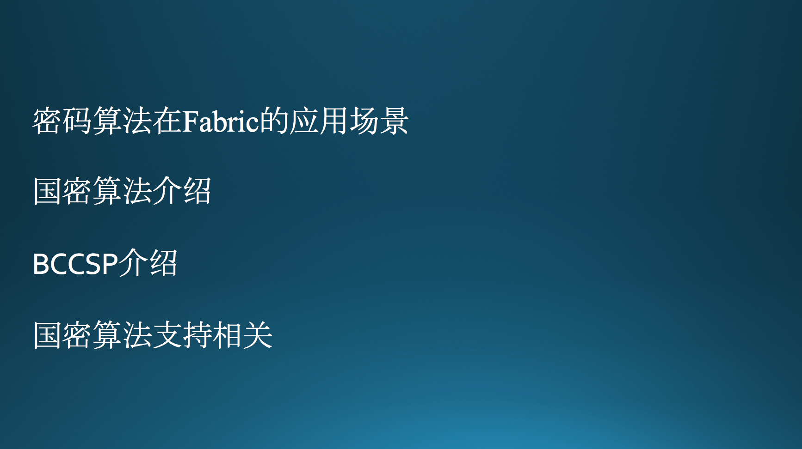
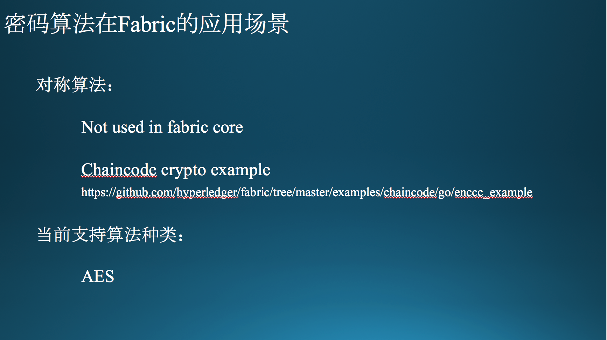
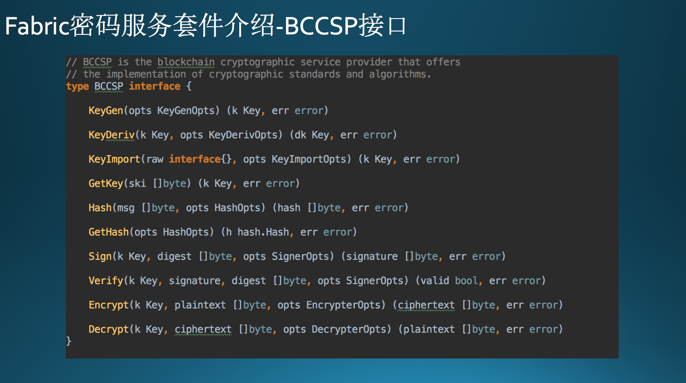
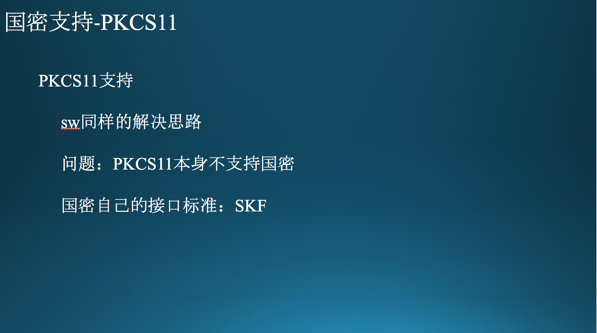
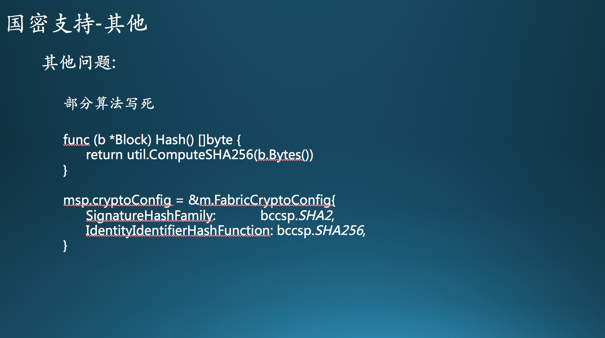

## 讲座内容

### Page 1

大家好，很荣幸被邀请至这里，和大家分享本人近期对 Hyperledger fabric 下面国密算法支持的一些工作情况。

我叫刘地军，中国网安重点实验室的研发工程师。最近团队在跟区块链相关的内容，个人也在积极跟进 fabric 项目的进展，很希望能为整个社区的发展、相关项目落地做一些贡献。附上联系方式，希望后面能和大家就相关技术问题更多的交流。

### Page 2

今天要分享的内容主要分为 4 个部分，首先是密码算法在 Fabric 中的应用场景，简单的国密算法介绍，Fabric 中 BCCSP 密码服务套件的介绍，最后着重介绍整个 Fabric 中的国密算法支持相关内容。

### Page 3

第一部分内容，首先介绍密码算法在整个 Fabric 中的应用场景。密码算法在区块链系统中起着举足轻重的作用,说是 no crypto no blockchain 也不足为过。密码算法大体分为非对称，对称和哈希散列三个大的种类，不同种类的密码算法用在了区块链系统的不同的地方。

首先介绍非对称算法的使用场景。非对称算法在 Fabric 中主要提供签名验签功能。签名验证工作存在于整个交易过程中，涉及到中间的每个节点。我们来看看整个交易生命周期中，签名验签是怎么发生作用的。

- **客户端** 在提交交易请求给背书节点时，需要在交易请求中附加自己对交易请求数据的签名。
- **背书节点** 首先需要验证客户端发起的交易请求，**验证** 请求的签名。并且会在执行完链码后，在 response 数据里面附加上自己的 **背书签名**。
- **客户端** 收到背书结果后，也需要对背书结果进行 **验签**。并且组装后发送给排序节点。
- **排序节点** 虽然并不会对交易内容进行验证，但是排序节点在出块的时候，也会在块上附上自己的 **签名**信息。
- **提交节点** 在更新账本前，会对交易背书内容进行验证，其中包括**验证**背书签名内容。

可以看到整个生命周期中，客户端，背书节点，排序节点，提交节点都参与了签名或者验签工作。
除此之外，
- 验证证书链本身的时候，用到了非对称算法相关内容
- 在建立 TLS 加密通道时，用到了非对称算法相关内容，值得注意的是，这个部分和交易部分是相对独立的。

### Page 4

介绍完非对称的应用场景，现在来看看哈希散列的应用场景。

如果说非对称是交易的基础，那么哈希散列可以说是账本的基础。

- 区块就是通过hash进行来链接的。每个 block 都会包含前一个 block 的 hash 值。
- hash 还在其他地方发挥重要作用，比如在进行签名前，需要对整个消息进行 hash，满足签名入参的消息格式。
- 一些产生 unique ID 的地方也用到了 hash，比如 key 的 SKI 值等。

### Page 5

把对称算法放到最后来介绍，因为对称算法在整个 Fabric 中，确实没有核心应用点。
有可能你的业务需要存储加密数据在账本上，可以看看这个

    https://github.com/hyperledger/fabric/tree/master/examples/chaincode/go/enccc_example

这个示例在 propose 交易的时候，会在 transient map里面附上对称加密秘钥和IV，这样 chaincode 就可以对数据进行加解密处理。保证存储在账本的数据变成只有你和特定 peer 之间的“小秘密”

### Page 6

接下来是第二部分,第一部分介绍了不同种类的密码算法的应用场景，这个部分主要介绍国密算法的相关内容。对应到上一章节的算法种类，国密算法可以提供 **SM2,SM3** 和 **SM4** 来提供支持。
国密算法是我国自己的密码行业标准，也是某些领域的准入门槛。所以在 Fabric 中引入国密算法标准对于超级账本项目在国内的商业推广有很重要的作用。

### Page 7

第三部分介绍一下 Fabric 中的BCCSP模块。整个 BCCSP 模块为 Fabric 提供密码算法相关的服务。从图中可以看到 BCCSP 通过 Membership Service（成员服务提供者）给相关核心功能和客户端SDK提供加密算法相关的服务。相关核心功能集中在 core 中，包括共识模块，背书模块等，在第一部分已经介绍了具体的业务场景。

通过 BCCSP，Fabric 中的密码算法模块可以实现插件式，多种实现方式和多种标准的适配。对国密算法的支持首先就要通过这个模块进行入手，后面讲国密算法支持会再次讲到这个部分。

### Page 8

现在我们来看看 BCCSP 的接口具体提供了哪些功能。图中是 BCCSP 的接口集合，大体分成 4 类，分为：
1. 秘钥生命周期管理
	- KeyGen 秘钥产生
	- KeyDeriv 秘钥派生
	- KeyImport 秘钥导入
	- GetKey    秘钥导出
2. 哈希散列管理
	- Hash   Hash 运算
	- GetHash 获取 Hash 功能
3. 签名验证管理
	- Sign 签名功能
	- Verify 验签功能
4. 加解密功能
	- Encrypt 加密功能
	- Decrypt 解密功能
	
### Page 9

Fabric 的密码算法支持都是依赖上一页中的四类接口完成的，开发者可以设计不同的 CSP 来提供不同形式的密码算法支持。现在 Fabric 提供了两种 CSP 可供选择，sw 模式和 pcks11 模式。

其中 sw 模式是一套软件算法集合，通过 golang 的 crypto 库，提供不同类型的算法软件实现。

pkcs11 是 RSA 提供的一套标准密码接口 API，BCCSP 的 pkcs11 模块可以为实现了对应 api 接口的设备提供支持。

对于国密的支持，可以自己重新设计 CSP，也可以根据上面两个现有模块进行定制支持。

### Page 10

最后第四部分，介绍 Fabric 中国密支持的解决思路。

首先了解一下进行国密支持需要关注哪几个方面内容。分为 4 个层次：**BCCSP，算法实现，X509 证书支持和秘钥相关** 内容。

- 第一点 BCCSP 前面已经介绍了，可以通过改造 sw 和 pkcs11 部分工作，提供软件和硬件层面的支持。
sw 提供一套密码算法集合，可以考虑在中间加入国密算法接口支持。
- 第二点是国密算法具体的实现，SM2,SM3,SM4 现在是公开标准，可以在公开渠道获取到算法细则，现在也有不同语言版本的实现可以参考。
- 第三点是 X509 证书支持，Fabric 中证书创建和解析相关是引入 golang 中的 X509 证书模块完成的，但是现在 x509 模块只支持 RSA 和 ECDSA 两种算法模式，所以如果直接引入原版的 X509 证书解析的话，在证书国密支持方面会比较棘手，这个问题在后面会进一步讨论。另外 X509 里面会根据 OID 来指定所使用的签名算法，签名参数等信息，这个部分可以参考《GMT 0015-2012》规范附件部分定义。
- 第四点是秘钥相关部分，其中包括通过证书封装的公钥部分，还有本地存储的私钥部分。特别注意到 sw 中算法是可以通过秘钥的类型来动态选择的，并且能够更灵活的应用，带格式的秘钥存储是有必要的。比如现在通过 pkcs1 来存储 RSA 私钥，通过 pkcs8 来存储 ECDSA 私钥，SM2 和 ECDSA 结构类似，也可以参考使用 PKCS8 来进行格式存储。

### Page 11

前面介绍了国密支持所需要关注的问题。除了 BCCSP 层面外，算法实现和 X509 证书支持 Fabric 都是直接引用的 golang 下面的标准库来支持的。

而标准库并没有对国密算法进行支持，所以这里引出了两种思路。

- 一种是把算法实现和 X509 的证书支持都放在 Fabric 层面来做。这种方式的好处是不用动 golang 的标准库，所有工作都收敛到 Fabric上。但是缺点是 X509 的证书部分需要在上层做定制，所有引入证书的地方，都需要做调整。代码也会有较多冗余部分。

- 另一种是将算法实现和 X509 国密支持部分放在 golang 的 standard lib 上，这样 Fabric 层面的适配就会少很多。这种的缺点的是 golang 部分需要做定制，特别是牵扯到用户环境还要同时考虑到 native 和 docker 环境两种方式下，golang 层面应该如何完成适配。后面会着重说这种方式的解决思路。

### Page 12

第二种支持方式个人认为较前者更优，能够在不影响整个 Fabric 架构的前提下，更好的完成国密支持，并且可以进行动态配置需要使用的算法，不失灵活性。

图中所示为整个国密支持中，Fabric 和 golang lib 层面所需要定制的部分。黄色代表需要 **修改部分**，红色代表 **新增部分**。

上层为 Fabric 需要处理的模块，主要集中在 BCCSP 部分。下层为 golang 层面需要处理的模块，主要集中在 crypto 中。
	
### Page 13

如果想在 golang 层面做支持的话，那么整个系统的构建环境就需要做一定的定制。

对于 native 的构建环境来说，需要将 golang 替换成国密版本支持的。

对于 docker 相关的，需要更改 docker image 中 golang 层的支持。Fabric 中，对 golang 的支持，是放在fabric-baseimage 中的。baseimage 中，将特定版本的 go 环境打包到镜像中，提供底层的支持。

baseimage 相关内容可以从 (官方仓库)[https://github.com/hyperledger/fabric-baseimage] 了解。

### Page 14

下面说一下 pkcs11 的国密支持，这块的解决思路和 sw 的相同，sw 的关注点 pkcs11 也同样需要关注。这里还需要注意的是 pkcs11 本身是不支持国密算法的。也就是对说如果要做支持需要对 PKCS11 的接口标准也做一定的更改，所以对于设备厂商来说，每家可能对接口标准的定制都不太一样，所以由于不标准，导致平台适配会出现问题。

国家密码管理局在 2011 年也制定了相关的接口标准，接口标准叫做 **SKF**。所以另一种考虑思路是，做国密支持可以通过 SKF 标准来做。

### Page 15

那么国密支持还有一些问题，是需要注意的，系统中有些调用算法的部分，是 hard code 进去的，比如区块的 hash 部分。这部分可以通过在配置文件中增加项来解决，做到所用到算法全程配置。

当然另一个问题是，是否系统中所有的算法都需要替换成国密标准，这个也是需要考虑的地方。

### Page 16

除此之外，作为整个系统来看，Fabric 做国密支持，也少不了外围的支持，包括 CA 和 client-sdk

- CA 可以考虑使用现有的国密 CA 系统，也可以考虑通过 Fabric-CA 来做搭建，fabric-ca 沿用 fabric 中的 BCCSP 套件，所以支持上难度也不大。

- client-sdk现在有很多种版本，所以有一些工作量在里面。好在每个版本的密码服务套件都是插件化的，比如 node 里面可以实现一套支持国密的 CryptoSuite 来提供支持。

### Page 17

本次 share 就到这里，谢谢大家。