# 超级账本 Fabric中添加对 EVM 智能合约的支持

金融科技高级专家群内部讲座系列活动。

由国内外金融科技相关顶尖团队的技术专家、学者和负责人等组成，目前仅限邀请加入。

分享内容会在 `TechFirst` 微信公众号进行首发，欢迎关注。

  

## 嘉宾介绍

郭剑南，现就职于 IBM 开放技术研究院，先后以代码贡献者的身份，活跃在 Cloud Foundry，Apache Mesos 等社区。现在主要参与 Hyperledger Fabric 的设计与开发。他也是 Hyperledger 中国工作组的积极志愿者，负责组织国内 Meetup 活动。

## 讲座内容

### Page 1
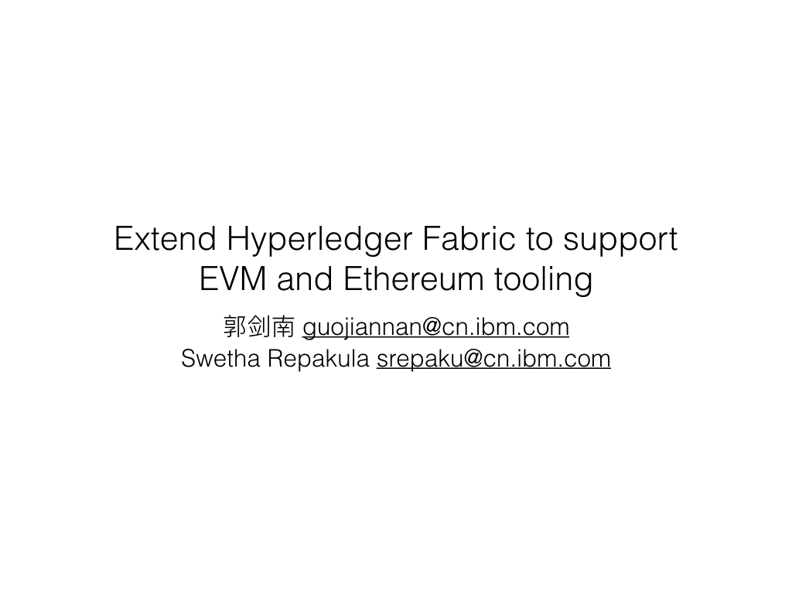

大家好，我是来自IBM开放技术研究院的郭剑南，社区中叫Jay，Rocket.chat用户名是@guoger。今天向各位专家汇报一下最近在Hyperledger Fabric中进行的集成EVM以及Ethereum中工具集的工作进展。这部分工作是由我和我们美国团队的Swetha Repakula共同设计和实现的。

### Page 2
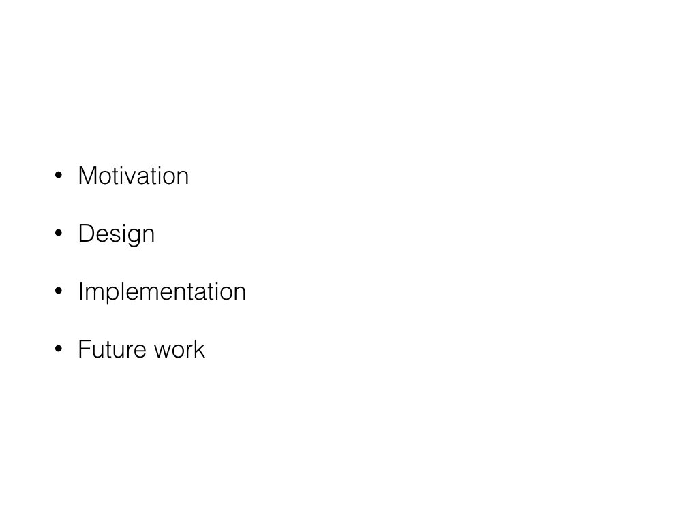

在今天的汇报中，我会首先介绍我们为什么要将EVM集成进Fabric，然后我会介绍设计和实现的过程以及其中碰到的一些问题。最后我会简单介绍下一步工作内容。

### Page 3
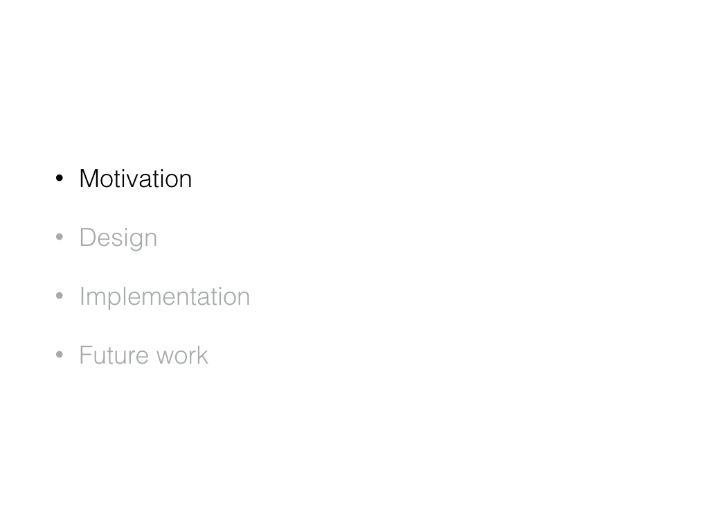

首先先向大家介绍一下我们为什么要做这部分工作。

### Page 4
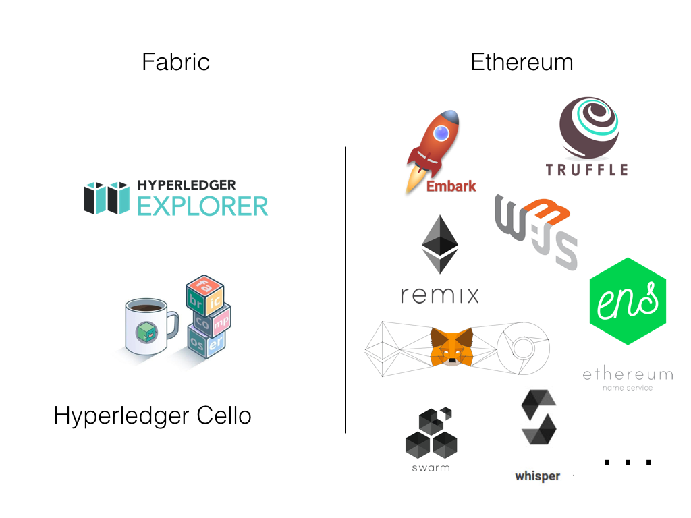

在开源世界中，健康的社区和生态系统一直以来都是一款开源软件成功的关键。Ethereum从2013年开始发展至今，受到广大开发者和爱好者的喜爱和追捧，在Ethereum生态系统中催生了许多工具和框架，比如大家熟知的Truffle，Remix和web3.js。这些工具降低了Ethereum的开发难度和成本，从而进一步推进了其接受程度，形成了良性循环。同时，Ethereum智能合约所使用的Solidity，Viper等“面向合约编程语言（Contract-Oriented Programming）”，也使得非软件工程背景的使用者能够快速上手开发区块链应用。与Ethereum相比，Fabric在这方面就略显薄弱，目前只能通过使用Golang，Node.js等“传统”编程语言，配合SDK开发应用，门槛较高。虽然已经有相关的工具，比如Explorer，Composer和Cello来加以辅助，仍无法与Ethereum相比。

### Page 5
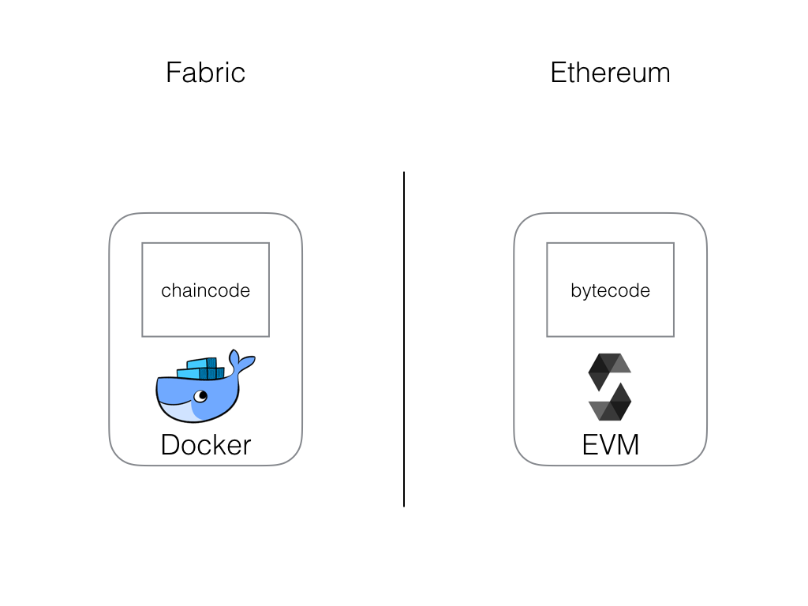

而且，Fabric的链码由通用编程语言编写，运行在Docker容器当中，理论上可以运行任意系统调用（虽然可以通过Docker的seccomp, apparmor等手段进行限制）。EVM在虚拟机运行时的层面，限制了智能合约所能进行的系统调用，相比Fabric降低了系统的attack surface，使得其更加安全。

### Page 6
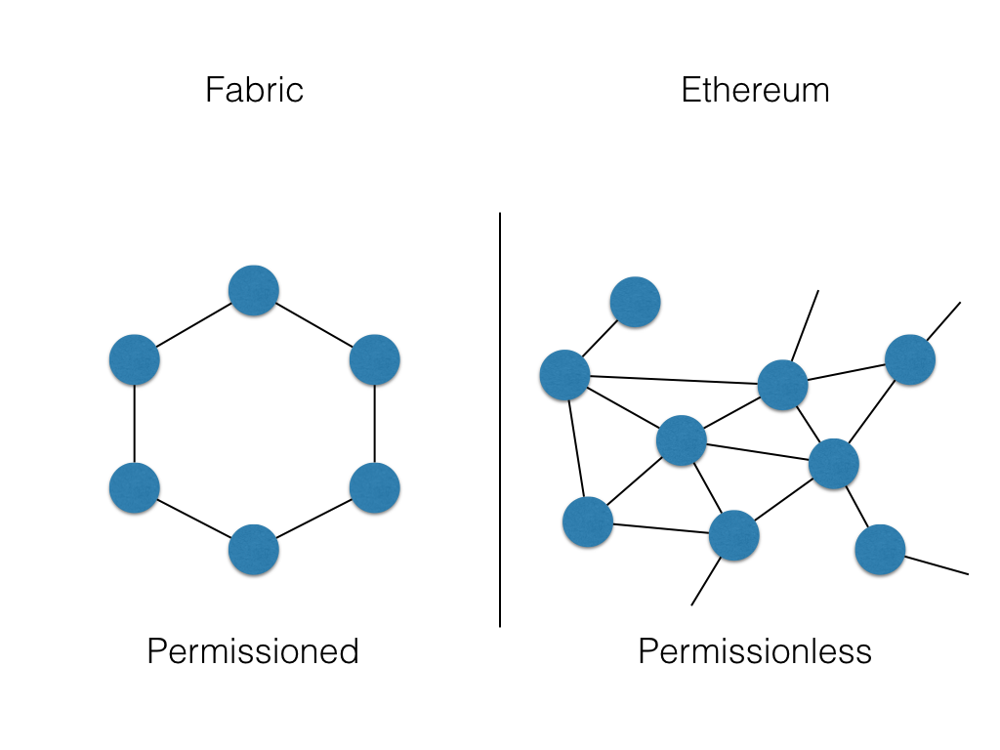

另一方面，Fabric作为一个联盟链（Permissioned chain），与Ethereum公有链（Permissionless chain）相比，实际使用场景和解决的问题有很多不同，一些基于Ethereum开发的应用，出于隐私和安全考量，可能更适合运行在联盟链上。这一点涉及到区块链的实际应用场景，在本次技术分享中就不做过多讨论。

### Page 7
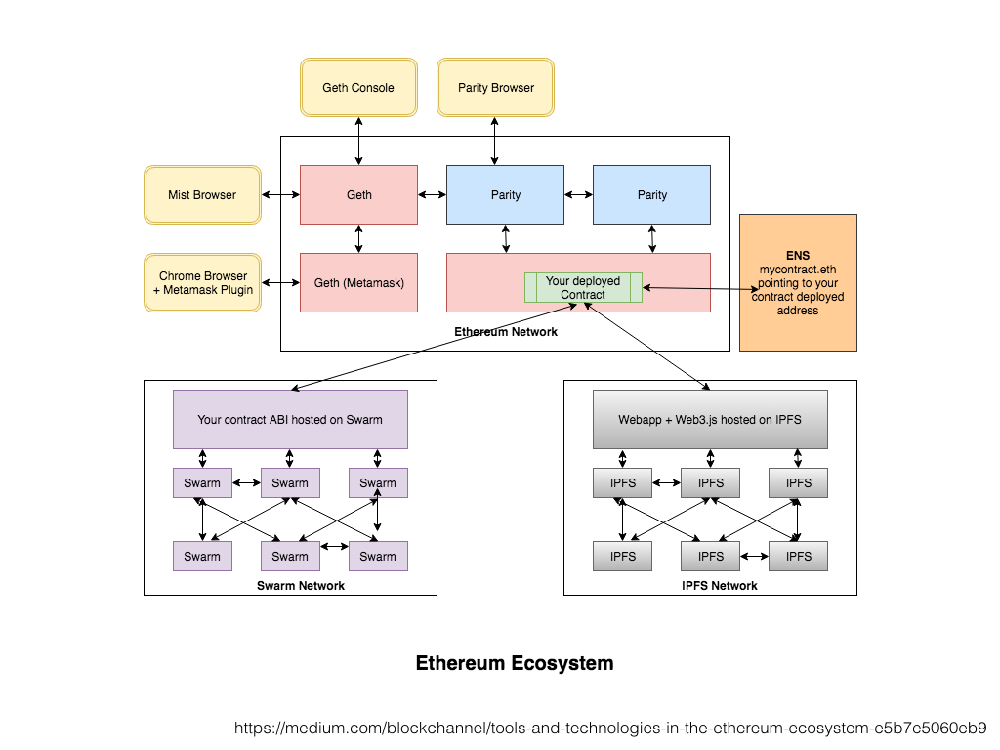

综上所述，Ethereum确实有许多Fabric所不具备的优势，同时两者也有不同的实际使用场景。那么，我们可以发挥想象力，取长补短。于是就有了下面的构想。

### Page 8
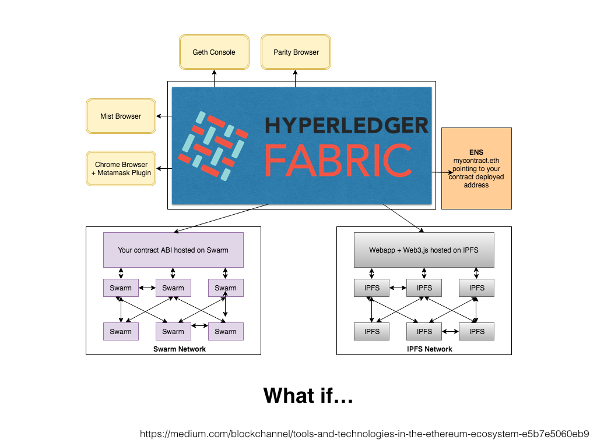

如果我们能够让Fabric运行EVM的bytecode，并且暴露一组Ethereum中的JSON RPC接口，从而对接web3.js等工具库，那么许多基于Ethereum开发的应用，如果需要适应联盟链的场景，就应用能够轻易地移植到Fabric中。同时，基于Fabric开发，调试和部署应用，也变得更加容易和高效。

### Page 9
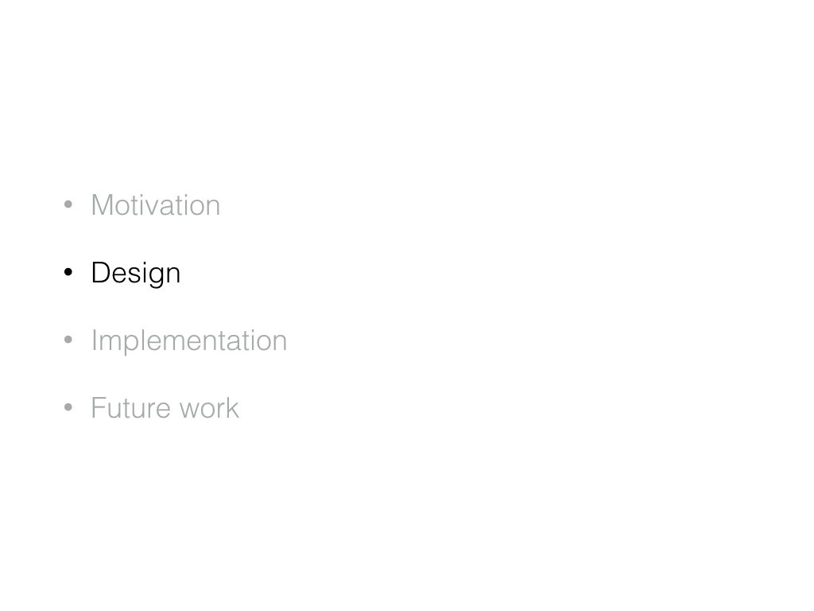

下面我来分享一下这部分工作的设计和过程中碰到的问题。

### Page 10
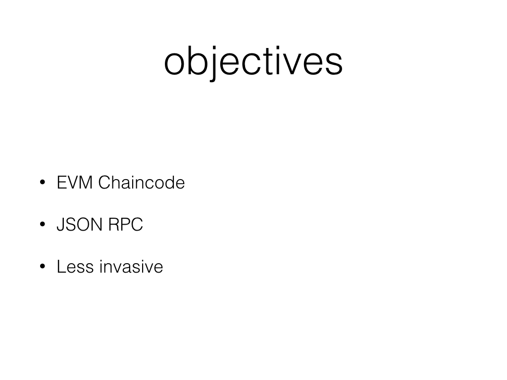

在设计之初，我们确定了三个目标：第一是使得Fabric中能够运行由Solidity、Viper等语言编译得到的bytecode；第二是让Fabric暴露一组Ethereum的JSON RPC接口，模拟相似的逻辑，比如提交一笔交易，部署一个应用；第三是尽量少地修改Fabric源码，大部分工作使用Fabric的可插拔机制，并基于SDK进行二次开发，主要代码都提交至Hyperledger/fabric-chaincode-evm代码库。

### Page 11
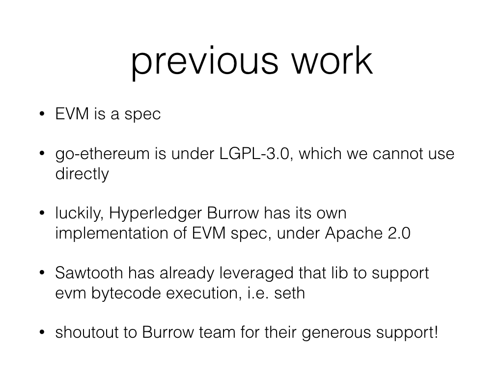

首先我们要明确的是，evm是在ethereum的yellow paper中定义的一个spec，使用的是Creative Common的许可，所以我们可以放心的使用。go-ethereum中有一套对该spec的实现，然而这个项目是LGPL-3.0的许可，而Fabric是Apache2.0的许可，如果直接使用会被污染。但是在Hyperledger Burrow这个项目中有另一套实现，是Apache 2.0的许可，我们可以放心的使用，Sawtooth这个项目其实已经将这个库集成进了他们的项目中，可以参见Seth（与Geth相对）这个模块。所以我们的任务变得简单许多，不用从新对照evm的spec去实现一个虚拟机，而是直接使用Burrow中的实现。在我们的设计和实现过程中，也得到了来自Burrow团队的极大支持，这也是开源软件和开放管理模式的魅力所在。

### Page 12
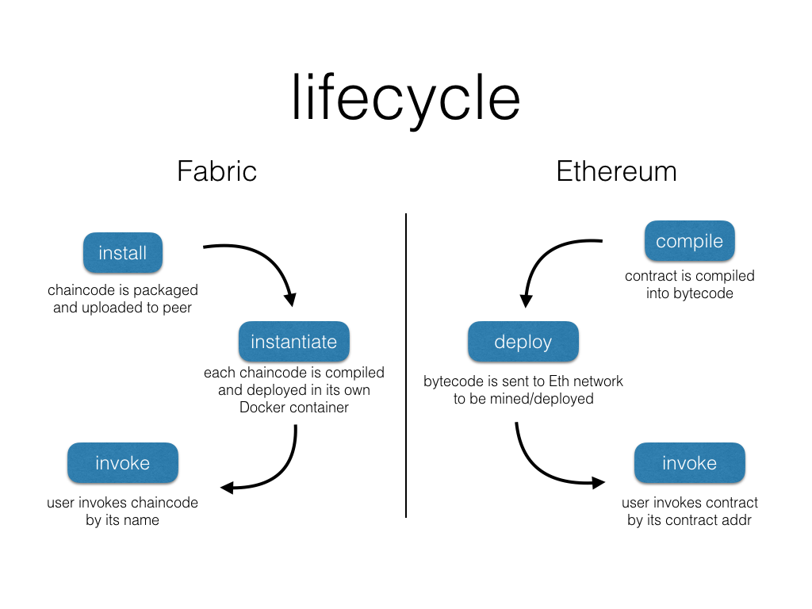

为了在Fabric中集成EVM运行时，从而能够部署和调用Ethereum的智能合约，我们要比较一下Fabric和Ethereum智能合约的生命周期管理。在Fabric v1.0中，智能合约的生命周期主要由LSCC进行管理，总的来说分为Install，instantiate和invoke。Install的时候，chaincode的代码会被打包在ChaincodeDeploymentSpec中上传至peer，存储在peer的文件系统中。instantiate时，peer将目标chaincode从FS中读取出来，使用ccenv进行编译并build Docker image，然后启动chaincode容器。该容器会向peer进行注册。然后在invoke的时候，peer与chiancode通过grpc接口进行通讯。
在Ethereum中，首先使用solc等编译工具将智能合约编译成为bytecode。安装合约时，bytecode被封装进tx并发送给零地址。当这个tx被执行时，合约代码会被存储在新创建的Contract Address当中。如果一个用户要调用该智能合约，则会向这个合约地址发送特定规则的tx，包含了所要调用的方法和参数。

### Page 13
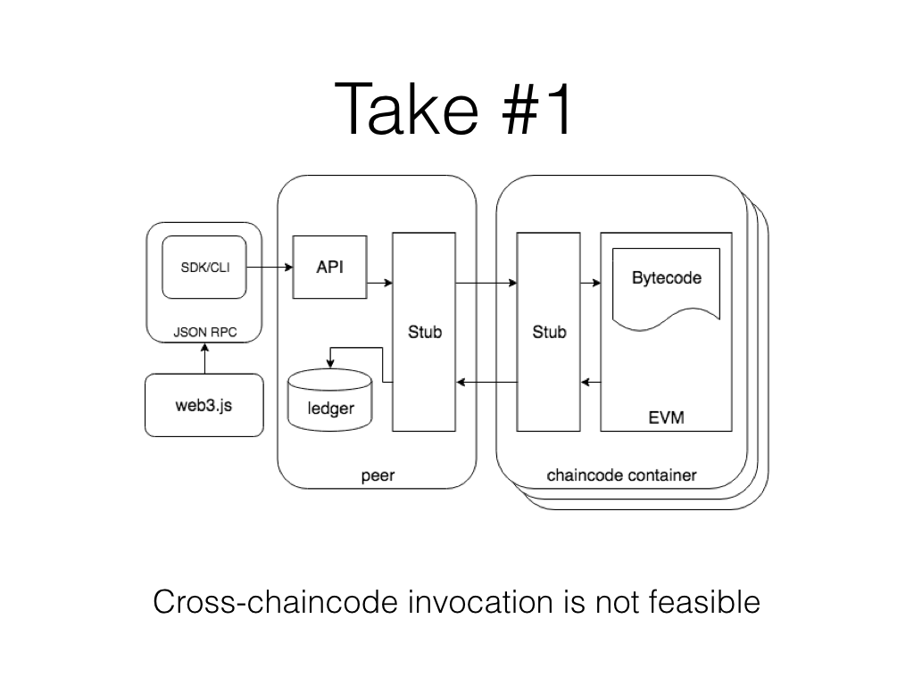

由此可见，这两个项目中，智能合约的生命周期管理还是有很大区别的。在一开始，我们希望能够复用Fabric的合约生命周期管理机制，也就是说用户可以将EVM作为一个新的类型的chaincode，像其他chaincode一样进行管理。每一个智能合约都被单独部署在自己的Docker container中。但是这会导致chaincode之间的调用无法实现。在当前的Fabric设计中，若一个chaincode要调用另一个，无论是user chaincode还是system chaincode，是通过shim interface中的`InvokeChaincode`实现的。然而，在Ethereum的设计理念中，调用一个合约其实就是向合约地址发送封装了调用参数和方法的tx。更重要的一点是，这些调用需要在同一个evm stack中进行，这与Fabric相违背。

### Page 14
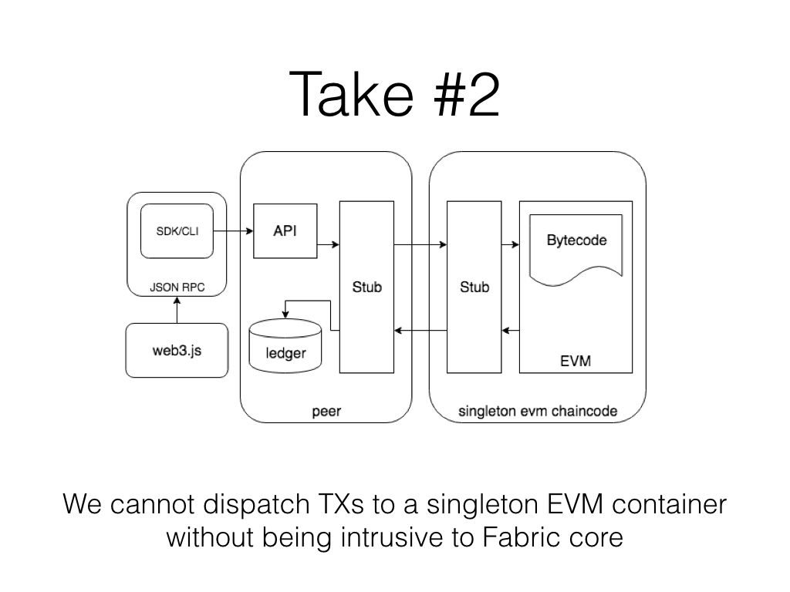

于是我们想到，是否可以在一个channel中只有一个EVM chaincode单例。每次收到一个EVM类型的tx时，在这个chaincode container中都会创建一个新的EVM实例来执行合约代码，类似于动态加载。但是这里的问题在于，chaincode的类型对于peer来讲是透明的，若不对现有逻辑进行必要的改动，我们无法做到根据tx的类型，将其重定向到某个cc容器单例。但是，evm chaincode单例看上去是一个解决问题的正确方向。

### Page 15
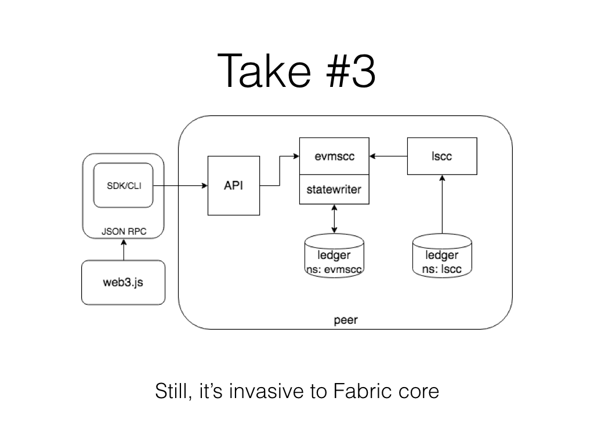

为了解决这个问题，我们想到可以将EVM实现成为一个系统链码的plugin：evmscc。首先，Fabric已经利用Go中的plugin特性，实现了系统链码的动态插拔（将现有系统链码剥离成为plugin的工作也在进行当中）。其次，在Fabric中，新创建的channel会自动部署一套新的系统链码，与其他channel隔离开来，这与我们的期望也是相符的。那么我们依然可以利用LSCC，将evm bytecode作为用户数据存储在lscc namespace当中。当evmscc被调用时，我们首先调用lscc获取相应的bytecode，创建evm实例进行执行。当一个合约调用另一个合约时，我们用同样的`GetAccount`加上`GetCode`逻辑获得目标合约的bytecode，并在同一个stack中执行。另外，我们需要在CLI添加一个flag指名调用的链码类型，如果是evm类型，则自动重定向到evmscc。我们的第一个PoC也是这么实现的。但是，这个设计依然需要一定程度上修改Fabric代码。

### Page 16
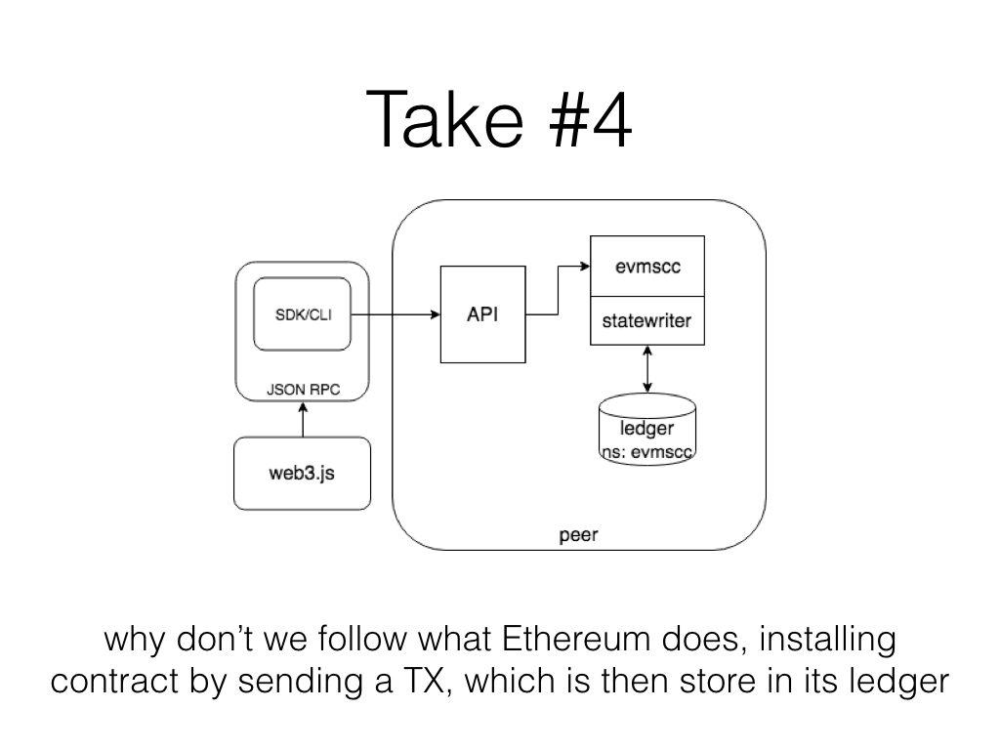

于是我们重新思考整个设计，意识到我们其实完全可以让Fabric对evm透明，遵循Ethereum的设计，所有的操作都作为tx被对待，忽略掉Fabric的lscc。合约的部署和调用都直接作为tx发送到evmscc，bytecode的存储和提取都通过实现Burrow的StateWriter、SatetUpdater等接口来实现。这使得设计变得简单，并且完全不用修改Fabric的代码。
在这个设计中，一个合约的部署过程如下：
1. 调用evmscc，第一个参数是零地址，第二个参数是合约的contract bytecode
2. evmscc收到这个tx后，将第一个参数作为callee address，通过零地址判断这是一个合约的部署请求。创建一个实例，并加载contract bytecode。
3. 通过caller address和seq number计算出合约地址（这里的caller address可以由`GetCreator`方法获取的调用者的pubkey计算得到）
4. 使用合约地址生成composite key，使用第二步中执行返回的runtime bytecode作为数据，写入evmscc的ledger，并将合约地址返回

合约的调用过程如下：
1. 调用evmscc，第一个参数是合约地址，第二参数是调用的函数和参数组成的payload
2. evmscc通过合约地址非零，推断这是一个合约调用请求，通过合约地址获取响应的bytecode
3. 创建一个evm实例并执行bytecode
4. 返回evm的执行结果

在Ethereum中，web3.js主要与Ethereum节点暴露的JSON RPC接口进行交互。那么如果我们要让Fabric适配web3.js，则需要在Fabric中实现一套相应的接口。但是这存在两方面问题：
* Fabric中，client需要与多个component进行交互，比如peer，ca，orderer，而web3.js只需要与一个组件进行交互即可，比如geth，两者之间的匹配比较困难
* 另外，我们依然希望尽可能少的修改Fabric代码。
所以，我们使用了另一个显而易见的方法，基于go-sdk实现了一个简单的proxy server，暴露一组JSON RPC接口，并将调用翻译成为Fabric的接口调用。

### Page 17
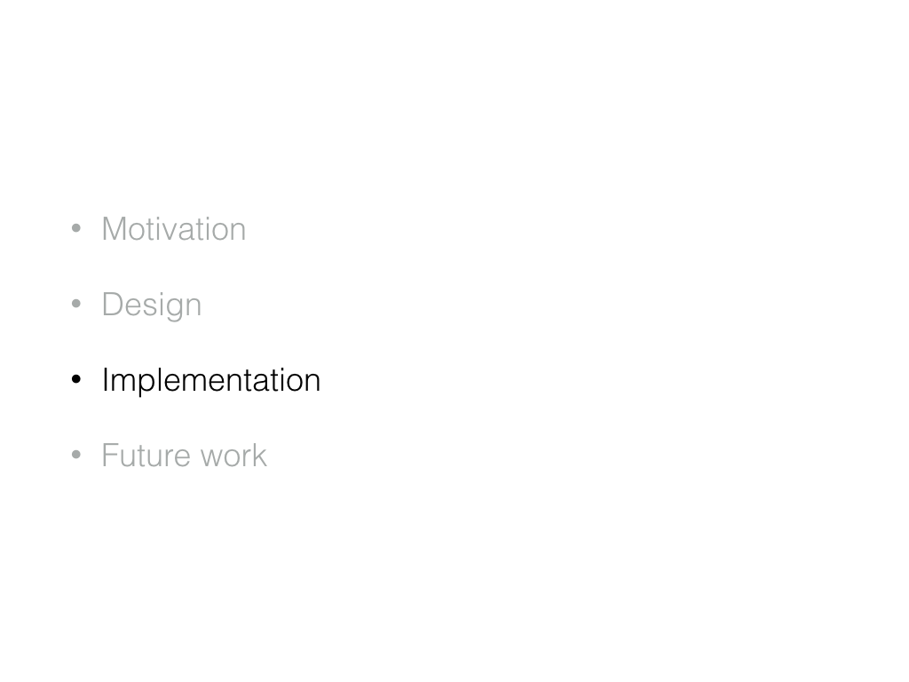

下面我们简单介绍一下具体实现过程

### Page 18
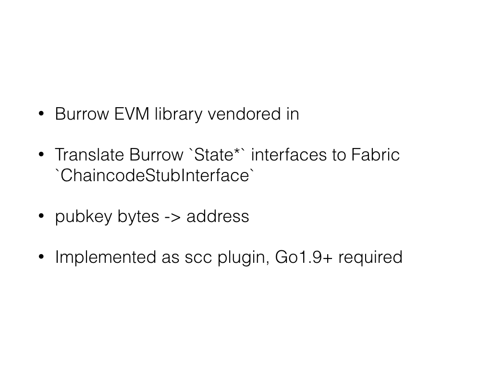

首先我们讲Burrow中的evm库vendor进fabric-chaincode-evm项目中
实现Burrow state.go中的`GetStorate`、`SetStorage`等方法，将其翻译成为Fabric中的`GetState`、`SetState`等接口。
在从pubkey计算address的时候，暂时比较简单地讲marshal后的pubkey bytes进行sha3-256哈希
evmscc实现为Fabric的scc plugin，所以可以通过修改peer的启动配置项来动态加载该插件

### Page 19
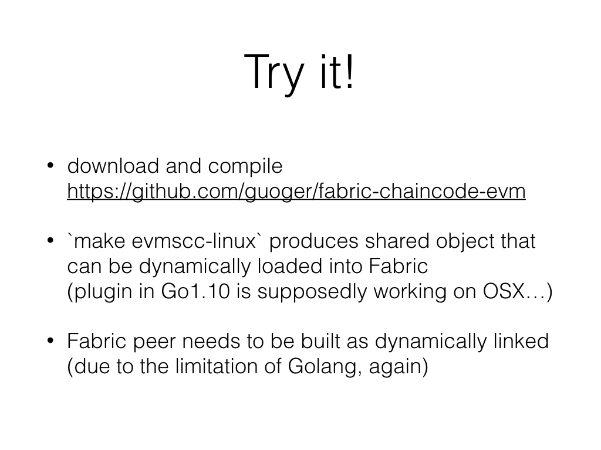

有兴趣的专家可以用如下方法进行试验。首先下载fabric-chaincode-evm代码并进行编译，得到针对linux平台的so文件。值得一提的是，在对plugin的编译中我们碰到如下问题，如果peer和fabric-chaincode-evm分别单独使用自己的vendor进行编译，那么他们所依赖的相同的库在实际执行中会被解析为不同的symbol，例如`github.com/hyperledger/fabric/vendor/golang.org/x/net/trace`和`github.com/hyperledger/fabric-chiancode-evm/vendor/golang.org/x/net/trace`。所以相同的库其实会被加载两次，一次是peer自己进行加载，一次是plugin在被load的时候进行加载。但是`golang.org/x/net/trace`这个库的init方法中会注册`/debug/request` endpoint，所以在第二次加载时会报错endpoint已经被占用，而trace对这个错误的处理是panic，这导致整个程序退出。所以我们在编译过程中其实是将fabric-chaincode-evm项目拷贝到fabric目录下，并对两个项目的vendor进行去重和合并，再进行plugin的编译，这样使得plugin的shared object文件中的symbol的在加载时可以被正确解析为fabric peer中已经有的symbol，避免重新加载。这一点比较hacky，但是无法避免，我们认为这是Golang语言现阶段的弊端，也是很多其他项目在使用`golang.org/x/net/trace`这个库时碰到的问题（grpc依赖这个库）。另外，暂时golang不支持静态链接的二进制文件调用plugin，所以我们在编译fabric peer时需要加上`DOCKER_DYNAMIC_LINK=true`这个flag。最后，虽然Go1.10已经支持plugin，但在我们的测试中发现依然有bug，所以evmscc暂时不能支持osx中的运行。

### Page 20
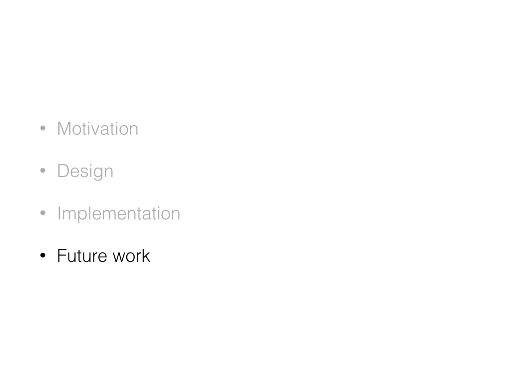

最后我们简单介绍一下未来的工作

### Page 21
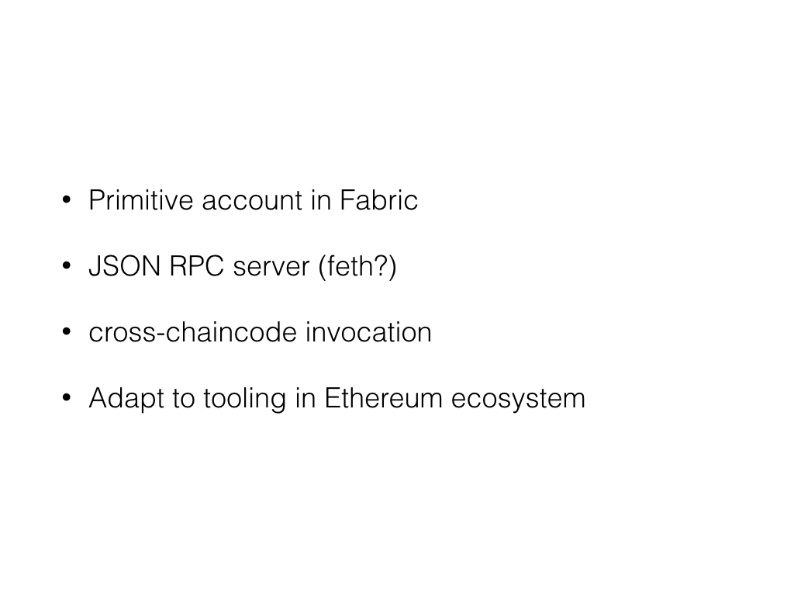

现阶段我们基本完成了这部分集成工作的phase 1，可以说是一个可用的poc。在phase 2中，我们目前有以下主要任务：
考虑在Fabric中原生地添加account这个概念，否则一些contract的opcode可能无法实现。
完善JSON RPC server的功能，将web3.js依赖的接口尽可能完善地翻译成为fabric的接口调用
我们需要验证合约之间的调用能正确执行
然后我们需要对接前文提到的Ethereum生态系统中的各个工具集，以使得这部分工作达到其真正的目的。

### Page 22

最后打一个广告，最近IBM Cloud为trial用户重新上线了免费的Blockchain as a Service服务，欢迎大家联系我来获取相应的激活码。

谢谢各位专家的耐心阅读，并请提出宝贵意见和建议！

## 答疑解惑

**问：请问这个实现保留了gas控制概念吗？如何定义和估量gas消耗，以及进行控制？**

答：Burrow的EVM实现中保留了gas，但是作用仅限于保护其不会被恶意合约代码进行DoS攻击，并没有以太坊中多个tx竞标的作用。Sawtooth在移植的时候，默认每个tx是9000，但是可以进行配置。我们暂时也打算这么做。如果大家有更好的建议可以提出来。

**问：虽然Go1.10已经支持plugin，但在我们的测试中发现依然有bug，请问大概是何种bug？**

答：Go1.10支持了OSX的plugin，但是我们常碰到seg violation。在golang的github中也有相应的issue，暂时不在我手头，找到了会发出来。

**问：这部分工作对跨链有何影响？**

答：说实话，关于跨链的具体场景，需求，以及用何种方式实现，我们也一直在探讨。这部分工作的目标暂时还不在跨链，主要是为了实现前面讲的，更好地提高开发者体验，并且方便应用的移植和互操作。但是我认为这可能是通向跨链的一小步。这一点也很希望与各位专家讨论。

**问：是否还支持evm用合约创建合约的做法？以生成不同的数据实例？**

答：暂时不支持，在下一个phase会做。

## 鼓励支持

如果你喜欢讲座分享的内容，欢迎通过如下微信二维码对专家进行支持和鼓励。

欢迎关注微信公众号留言。

===== 关于 TechFirst 公众号 =====

专注云计算、大数据、Fintech、人工智能、分布式相关领域的热门技术与前瞻方向。

发送关键词（如区块链、云计算、大数据、人工智能），获取热门点评与技术干货。

如果你喜欢公众号内容，欢迎鼓励一杯 coffee~

  

